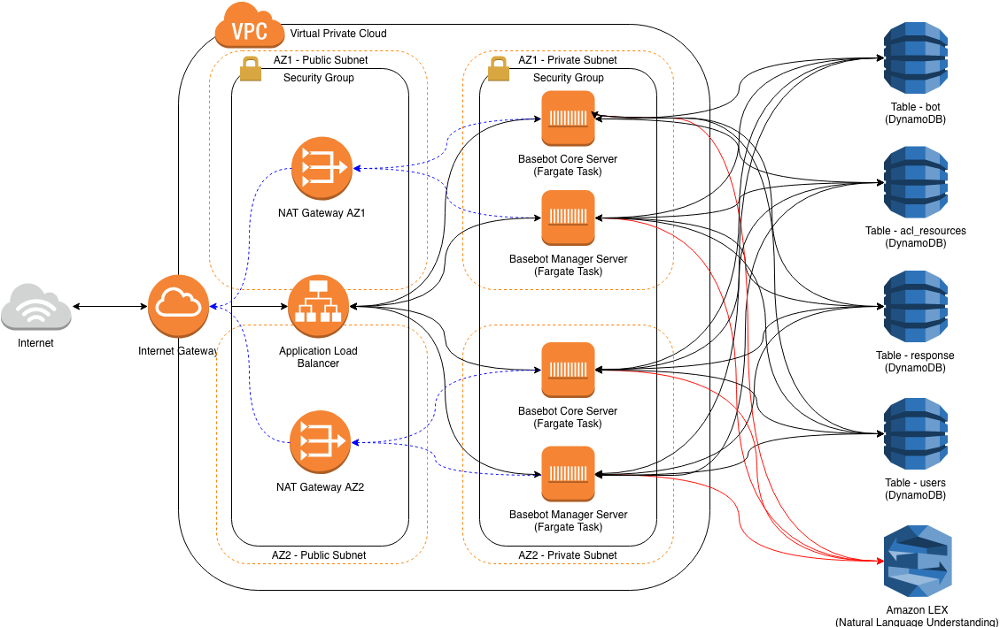

# AWS BaseBot - Deployment Guide

 

This guide provides instructions on how to deploy ANS BaseBot for AWS, the deployment is provided as an easy to deploy CloudFormation template that will have you up and running in a matter of minutes.

## Pre-requisites

Before deploying the tempalate there are a number of pre-requsites that need to be met along with some additional information you will required to provide.

* An AWS Account with AWS Administrator privileges.
* An SSL certificate that has either been created in or imported to AWS Certificate manager in the region the template is to be deployed.
* A CIDR range for the VPC which will then be split into 4 subnets, ANS recommend this should be a /24, but can support CIDR address space that support a greater number of IP Addresses than a /24.

## Architecture

The AWS BaseBot solution is designed to build a standardised AWS infrastructure to host the BaseBot core and manager Docker containers and has been designed to provide both resiliency and security, whilst utilising services that keep operational tasks to a minimum.

The design utilises AWS Fargate to provide a managed compute service that hosts the BaseBot Server Docker containers, persistent and stateful information is stored in DynamoDB tables, AWS ELBv2 (Application Load balancer) is used to make the bot server available to Bot clients on the internet. Amazon LEX is integrated into the Bot server to provide AI based Natural Language Processing.

